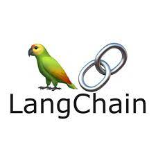

<h1 align="center">

</br>
Busca Semantica IA
</h1>

Aplicação de estudo, implementada em scripts node de forma simplista, sobre langchain que utiliza modelos GPT e Embbedings da openAi, ao qual é tratada as informações do livro "A arte da guerra" de Sun Tzu.

É realizada a leitura do arquivo, feita sua transformação em chunks, e utilizado o modelo de embbedings para salva-los de forma semântica em um banco Redis vetorial.
A partir do RedisVectorStore como retriever, é criado uma Chain, utilizando o GPT como modelo base, e alimentando o mesmo com as informações do retriever, par que a IA gere respostas a partir da base de conhecimento proprietária.

Como o objetivo de estudo era as conexões de modelos com o langchain, foi criado um sevidor extremamente simples em express apenas para emular uma aplicação final por uma rota post.

### Executando o projeto

Crie o Arquivo .env com base no .env.example e popule com sua OPENAI_API_KEY

Criando banco Redis Stack com o docker

```
docker run -d --name redis-stack -p 6379:6379 -p 8081:8081 redis/redis-stack:latest
```

Para vizualizar a aplicação final, pode-se iniciar o servidor express com o comando abaixo.

```
pnpm run dev
```

E realizar uma requisição POST para a rota http://localhost:3333 com o modelo de body json abaixo:

```
{
    "question" : "O que é doutrina?"
}
```

É possivel também executar os scripts de forma isolada para um maior ententimento das partes.
